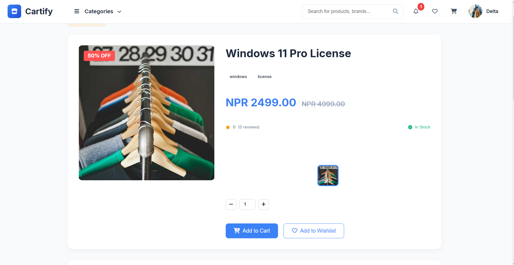
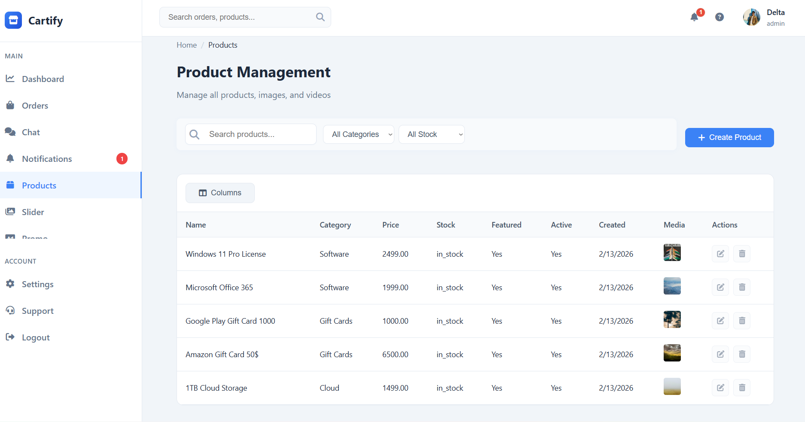
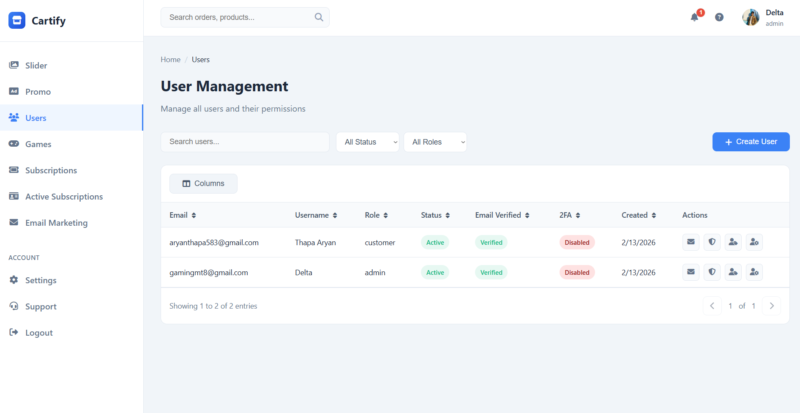
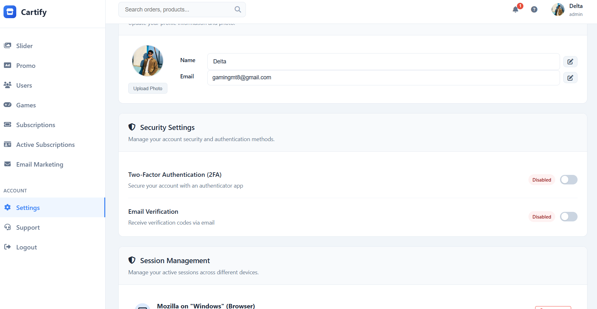

# 🚀 Ecommerce Platform

A powerful, modern, and real-time e-commerce application built with **Node.js**, **Express**, **MySQL**, and **EJS**. This platform supports diverse purchasing options, including game top-ups, product subscriptions, and standard products, featuring a robust admin management system and real-time chat support.

## 📸 Sneak Peek

### 📊 Homepage Overview

|            Main Homepage             |              Featured Products              |
| :----------------------------------: | :-----------------------------------------: |
|  | .png>) |

### 📁 Product & Management

|                  Product Details                   |                    Product Management                    |
| :------------------------------------------------: | :------------------------------------------------------: |
|  |  |

### 👥 User & Settings

|                  User Management                   |           Account Settings           |
| :------------------------------------------------: | :----------------------------------: |
|  |  |

## ✨ Features

- **🔐 Secure Authentication**: JWT & Session-based login, registration, and professional password reset flow.
- **🌐 Social Login**: Integrated Google and Facebook OAuth for seamless access.
- **🛡️ Multi-Factor Authentication (2FA)**: Enhanced security with TOTP-based two-factor authentication.
- **🎮 Specialized Services**: Dedicated modules for **Game Top-ups** and **Product Subscriptions**.
- **💬 Real-time Chat Support**: Built-in customer support chat system powered by **WebSockets (ws)**.
- **📦 Order Management**: Comprehensive tracking of orders, payments, and delivery status.
- **📄 PDF Invoices**: Automatic generation of orders and payment vouchers in PDF format.
- **🛠️ Admin Dashboard**: Extensive tools for managing users, products, orders, and site settings.
- **🔒 Security & Protection**: Robust API protection with **Helmet**, **CORS**, and advanced input validation.
- **📧 Automated Emailing**: Transactional emails for OTPs, password resets, and notifications via **Nodemailer**.

## 🛠️ Tech Stack

### Frontend

- **Template Engine**: EJS (Embedded JavaScript)
- **Styling**: Vanilla CSS, FontAwesome, Google Fonts
- **Logic**: Vanilla JavaScript, WebSocket Client
- **Interactions**: Real-time updates via WebSockets

### Backend

- **Core**: Node.js, Express.js
- **Database**: MySQL (managed via mysql2 pool)
- **Security**: JWT, Bcrypt, Speakeasy (2FA), Helmet, Passport.js
- **Real-time**: WebSocket Server (ws)
- **Communication**: Nodemailer, PDFKit, QRcode

---

## 🚀 Getting Started

### Prerequisites

- **Node.js**: v18 or higher
- **MySQL**: Running instance
- **NPM**

### Installation

1.  **Clone the repository**:

    ```bash
    git clone https://github.com/Aryan-Thapa-Np/Ecommerce-Website.git
    cd Ecommerce-Website
    ```

2.  **Install dependencies**:

    ```bash
    npm install
    ```

3.  **Setup Environment Variables**:
    Create a `.env` file in the root directory and add the following:

    ```env
    # Server Configuration
    PORT=3000
    NODE_ENV=development

    # Database Configuration
    DB_HOST=localhost
    DB_USER=your_user
    DB_PASSWORD=your_password
    DB_NAME=secure_auth_db

    # Security
    JWT_SECRET=your_super_secret_key
    SESSION_SECRET=your_session_secret
    CSRF_SECRET=your_csrf_secret

    # Email Service
    EMAIL_HOST=smtp.gmail.com
    EMAIL_PORT=587
    EMAIL_USER=your_email@gmail.com
    EMAIL_PASS=your_app_password

    # OAuth
    GOOGLE_CLIENT_ID=your_google_client_id
    GOOGLE_CLIENT_SECRET=your_google_client_secret
    ```

4.  **Database Setup**:
    - Create a database named `secure_auth_db`.
    - Import the `database.sql` file provided in the root directory to set up the tables.

### Running the Application

To run the server:

```bash
npm start
```

- **Website**: `http://localhost:3000`

---

## 📜 Available Scripts

- `npm start`: Starts the application using `node server/server.js`.
- `node server/server.js`: Direct execution of the server entry point.

---

## 🛡️ License

Distributed under the MIT License. See `LICENSE` for more information.

---

## 🤝 Contributing

Contributions are what make the open-source community such an amazing place to learn, inspire, and create. Any contributions you make are **greatly appreciated**.

1. Fork the Project
2. Create your Feature Branch (`git checkout -b feature/AmazingFeature`)
3. Commit your Changes (`git commit -m 'Add some AmazingFeature'`)
4. Push to the Branch (`git push origin feature/AmazingFeature`)
5. Open a Pull Request

---

## 📬 Contact

**Aryan Thapa** - [Aryan-Thapa-Np](https://github.com/Aryan-Thapa-Np)

Project Link: [https://github.com/Aryan-Thapa-Np/Ecommerce-Website](https://github.com/Aryan-Thapa-Np/Ecommerce-Website)

---

_Made with ❤️ by Aryan Thapa_
